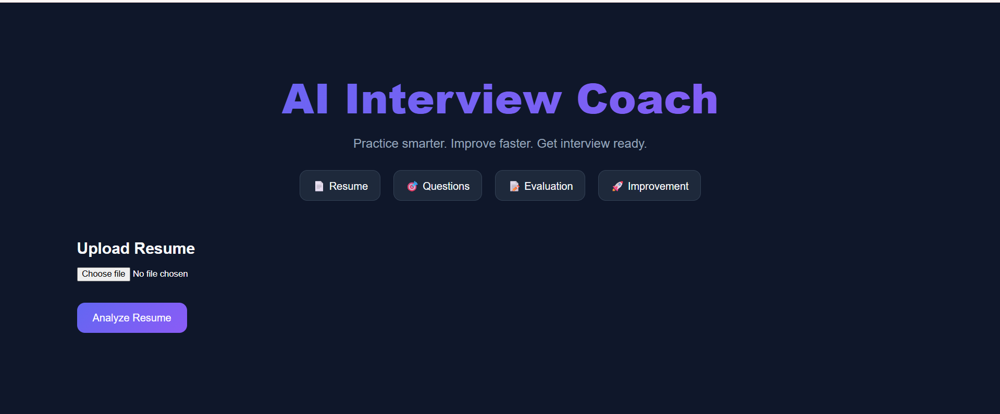
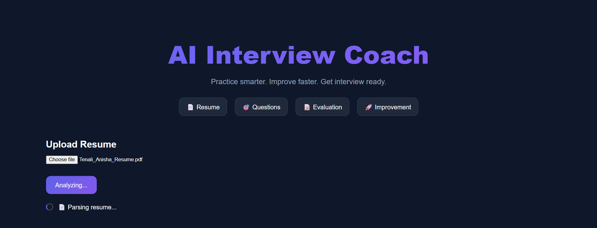
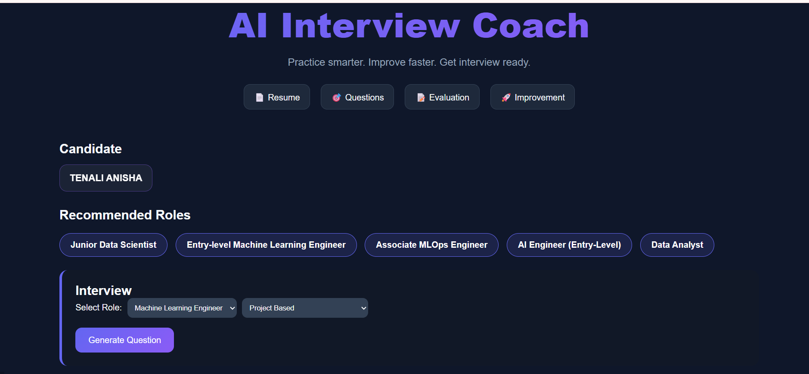
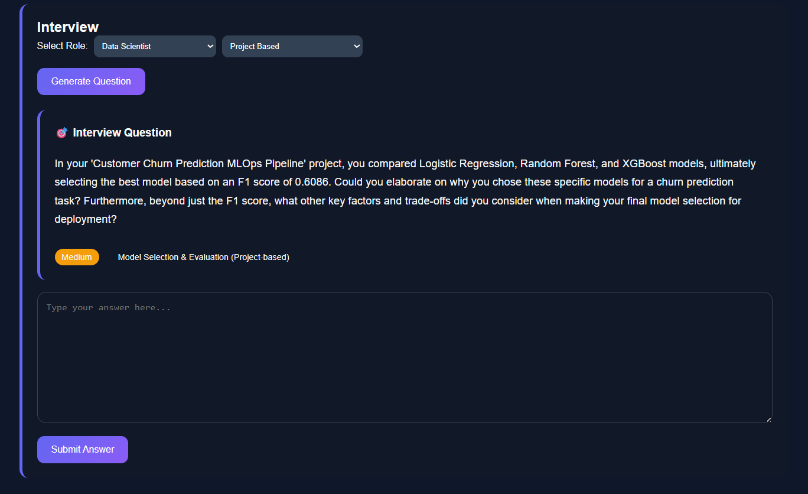
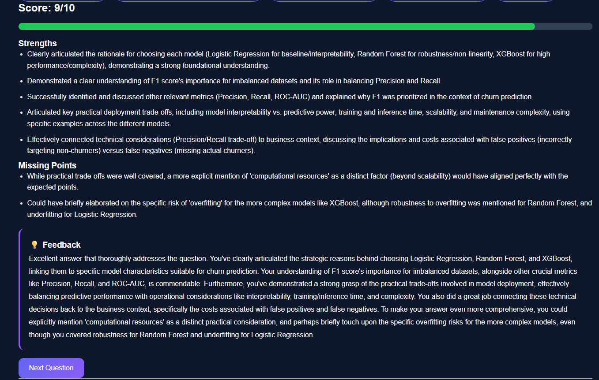
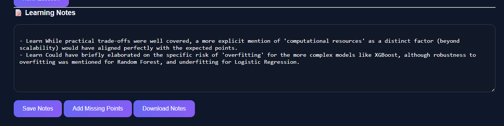

# 🚀 AI Interview Coach

AI Interview Coach is a full-stack Generative AI application that helps candidates prepare for interviews through personalized resume analysis, role recommendations, AI-generated interview questions, answer evaluation, and learning notes.

The platform analyzes a candidate's resume, identifies suitable career paths, generates tailored interview questions, evaluates responses, and highlights missing concepts for continuous improvement.

---

## 🎯 Problem Statement

Traditional interview preparation is often generic and does not adapt to a candidate's background, projects, skills, or career goals.

AI Interview Coach solves this problem by:

- Analyzing resumes automatically
- Recommending suitable roles
- Generating personalized interview questions
- Evaluating answers with detailed feedback
- Tracking learning gaps and improvement areas

---

## ✨ Features

### 📄 Resume Analysis

- Upload resume in PDF format
- Extract candidate information
- Analyze skills, projects, and technologies
- Recommend suitable job roles

### 🎤 Personalized Interview Generation

Supports multiple interview types:

- Project-Based Interviews
- Technical Interviews
- Behavioral Interviews
- System Design Interviews
- DSA Interviews

Questions are generated based on:

- Resume content
- Selected role
- Selected interview type

### 🚫 Intelligent Question Diversity

The system avoids:

- Repeated questions
- Repeated interview topics
- Repeated interview styles

This ensures broader interview coverage across projects, skills, technologies, and concepts.

### 🧠 AI-Powered Evaluation

Candidate answers are evaluated on:

- Technical correctness
- Completeness
- Communication clarity
- Conceptual understanding

The system provides:

- Score (/10)
- Strengths
- Missing Points
- Detailed Feedback

### 📝 Learning Notes

Candidates can:

- Save interview learnings
- Auto-add missing concepts
- Download notes as a text file
- Build a personalized interview revision guide

### 🎨 Modern User Interface

- Dark theme design
- Responsive layout
- Interactive role cards
- Progress-based interview flow
- Clean interview workspace

---

## 🏗️ System Architecture

```text
                Resume Upload
                       │
                       ▼
              Resume Parser
                       │
                       ▼
             Resume Analyzer
                       │
                       ▼
           Role Recommendation
                       │
                       ▼
        Interview Question Generator
                       │
                       ▼
             Candidate Answer
                       │
                       ▼
             Answer Evaluator
                       │
                       ▼
       Strengths + Missing Points
                       │
                       ▼
              Learning Notes
```

---

## ⚙️ Tech Stack

### Frontend

- React.js
- Vite
- Axios
- CSS

### Backend

- FastAPI
- Python

### AI Layer

- Google Gemini API

### Deployment

- Vercel (Frontend)
- Render (Backend)

---

## 📂 Project Structure

```text
AI-INTERVIEW-COACH
│
├── backend
│   ├── database
│   ├── models
│   ├── routes
│   ├── services
│   └── testing
│
├── frontend
│   ├── public
│   ├── src
│   │   ├── assets
│   │   ├── components
│   │   ├── pages
│   │   └── services
│
├── docs
│
├── prototype
│
└── README.md
```

---

## 🧠 AI Components

### Resume Analyzer

Extracts:

- Skills
- Technologies
- Projects
- Experience
- Education

Generates:

- Candidate summary
- Recommended roles

### Question Generator

Generates personalized questions based on:

- Resume content
- Role selection
- Interview type

Ensures:

- No repeated questions
- No repeated topics
- No repeated interview styles

### Answer Evaluator

Evaluates:

- Technical depth
- Missing concepts
- Completeness
- Communication quality

Returns:

```json
{
  "score": 7,
  "strengths": [],
  "missing_points": [],
  "feedback": ""
}
```

---

## 📸 Screenshots

### Resume Analysis




### Recommended Roles



### Interview Question Generation



### AI Evaluation



### Learning Notes



---

## 🚀 Installation

### Clone Repository

```bash
git clone https://github.com/Anisha3056/ai-interview-coach.git

cd ai-interview-coach
```

### Backend Setup

```bash
cd backend

python -m venv venv

venv\Scripts\activate

pip install -r requirements.txt

uvicorn main:app --reload
```

Backend runs on:

```text
http://localhost:8000
```

### Frontend Setup

```bash
cd frontend

npm install

npm run dev
```

Frontend runs on:

```text
http://localhost:5173
```

---

## 🔑 Environment Variables

Create a `.env` file inside the backend directory.

```env
GEMINI_API_KEY=YOUR_API_KEY
```

---

## 📈 Future Improvements

- User Authentication
- Interview History Tracking
- Performance Dashboard
- Progress Analytics
- AI-generated Roadmaps
- Voice-Based Mock Interviews
- Video Interview Simulation
- Interview Difficulty Progression
- Question Bookmarking
- Company-Specific Interview Modes

---

## 🎓 Learning Outcomes

This project helped in understanding:

- Full Stack Development
- FastAPI API Design
- React State Management
- Generative AI Integration
- Prompt Engineering
- Resume Parsing
- Interview Evaluation Systems
- Error Handling
- Deployment Workflows

---

## 👩‍💻 Author

**Anisha Tenali**

B.Tech CSE 

Passionate about Machine Learning, Data Science, NLP, Recommendation Systems, and AI-powered products.

GitHub:

```text
https://github.com/Anisha3056
```

